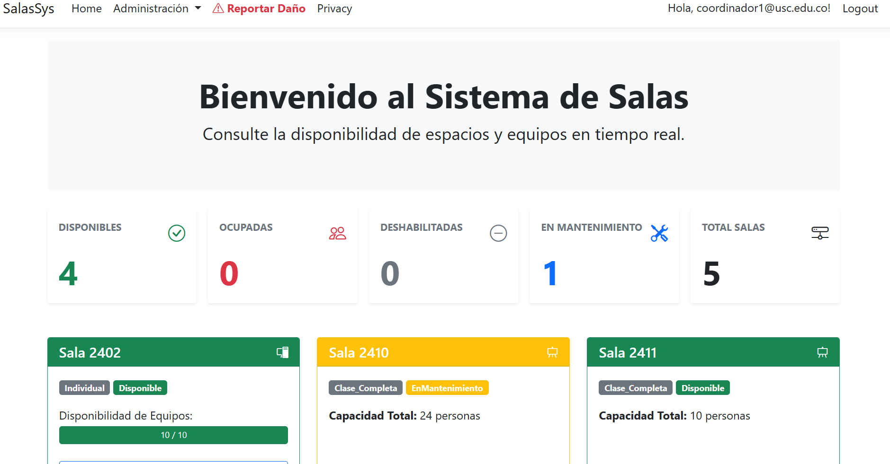
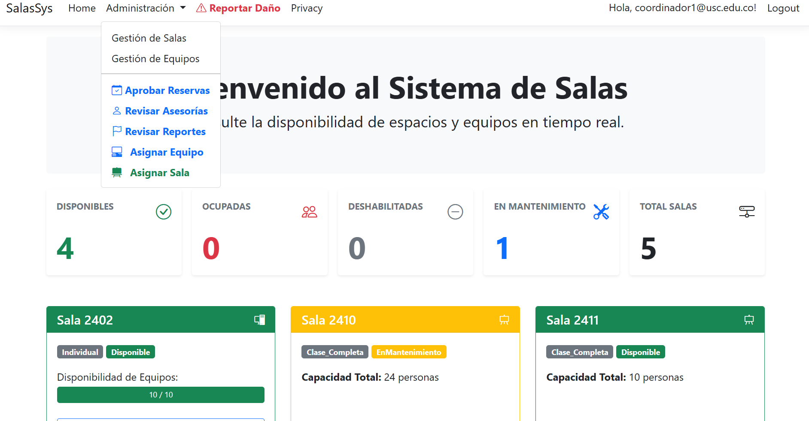

# 🏛️ Sistema de Administración de Salas de Sistemas (SASS)

Una aplicación web robusta desarrollada en **ASP.NET Core MVC** para la gestión integral de laboratorios de cómputo, préstamos de equipos y asistencia técnica en un entorno universitario.


## 📋 Descripción

Este sistema permite automatizar el flujo de préstamo de recursos tecnológicos. Facilita a los estudiantes la reserva de equipos individuales y a los profesores la reserva de aulas completas, mientras provee a los administradores y coordinadores herramientas para la gestión de inventario, aprobación de solicitudes y seguimiento de daños.

## ✨ Características Principales

### 👥 Roles y Permisos
* **Administrador:** Gestión total del sistema (Salas, Equipos, Usuarios, Roles).
* **Coordinador:** Aprobación de reservas, atención de reportes de daños y gestión de asesorías técnicas.
* **Profesor:** Reserva de salas completas y reporte de incidentes.
* **Estudiante:** Reserva de equipos individuales (con restricciones) y solicitud de ayuda.

### 🚀 Funcionalidades Clave
* **Dashboard en Tiempo Real:** Visualización gráfica del estado de las salas (Disponible/Ocupada) y disponibilidad de equipos calculada al instante.
* **Sistema de Reservas Inteligente:**
    * Validación de cruce de horarios.
    * Restricciones de negocio (Máx 2 horas, Máx 2 reservas al día para estudiantes).
    * Validación de horarios de operación (7:00 AM - 9:30 PM, Domingos cerrado).
* **Gestión de Inventario:** CRUD de Salas y Equipos con validaciones de capacidad.
* **Módulo de Reportes de Daños:** Flujo de estados (Pendiente -> En Proceso -> Cerrado/Rechazado).
* **Módulo de Asesorías:** Solicitud de ayuda técnica en sitio.

## 🏗️ Arquitectura

El proyecto sigue una arquitectura por capas para garantizar la escalabilidad y mantenibilidad:

* **Domain:** Entidades del negocio (`Sala`, `Equipo`, `Reserva`, `AppUser`) y Enums. No tiene dependencias externas.
* **Infrastructure:** Contexto de Datos (`AppDbContext`), Migraciones y Repositorios (`Repository Pattern`).
* **Services:** Lógica de negocio pura, Validaciones, DTOs y Mapeo (`AutoMapper`).
* **Web:** Controladores, Vistas (Razor Views) y lógica de presentación.

## 🛠️ Tecnologías Utilizadas

* **Framework:** ASP.NET Core 8 MVC
* **ORM:** Entity Framework Core (SQL Server)
* **Autenticación:** ASP.NET Core Identity
* **Mapeo:** AutoMapper
* **Frontend:** Bootstrap 5, jQuery, Bootstrap Icons
* **Base de Datos:** SQL Server (LocalDB / Production)

## ⚙️ Configuración e Instalación

Sigue estos pasos para ejecutar el proyecto localmente:

1.  **Clonar el repositorio**
    ```bash
    git clone [https://github.com/TU_USUARIO/Sistema-Administracion-Salas.git](https://github.com/TU_USUARIO/Sistema-Administracion-Salas.git)
    ```

2.  **Configurar Base de Datos**
    Abre el archivo `Web/appsettings.json` y asegúrate de que la cadena de conexión apunte a tu instancia local de SQL Server:
    ```json
    "ConnectionStrings": {
      "DefaultConnection": "Server=(localdb)\\mssqllocaldb;Database=SalasDB;Trusted_Connection=True;MultipleActiveResultSets=true"
    }
    ```

3.  **Aplicar Migraciones**
    Abre la consola en la carpeta de la solución y ejecuta:
    ```bash
    dotnet ef database update --project Infrastructure --startup-project Web
    ```
    *(O usa la Consola del Administrador de Paquetes en Visual Studio: `Update-Database`)*

4.  **Ejecutar la Aplicación**
    ```bash
    dotnet run --project Web
    ```

## 🔐 Usuarios por Defecto (Data Seeding)

Al iniciar la aplicación por primera vez, se crearán automáticamente los roles y un usuario administrador:

* **Email:** `admin@usc.edu.co`
* **Contraseña:** `Admin123!`

## 📸 Capturas de Pantalla
### Vista del Dashboard

### Nav del Admin

[]([http://juanobando04-001-site1.jtempurl.com](https://datasoulcol.netlify.app/)

## 🤝 Contribución

1.  Haz un Fork del proyecto.
2.  Crea tu rama de características (`git checkout -b feature/NuevaCaracteristica`).
3.  Haz Commit de tus cambios (`git commit -m 'Agregada nueva característica'`).
4.  Haz Push a la rama (`git push origin feature/NuevaCaracteristica`).
5.  Abre un Pull Request.

## 📄 Licencia

Este proyecto está bajo la Licencia MIT - mira el archivo [LICENSE](LICENSE) para más detalles.

---
Desarrollado por:
- Juan Sebastian Obando
- Erika Muñoz
- Cristian Cifuentes
- Juan Camilo Zapata
